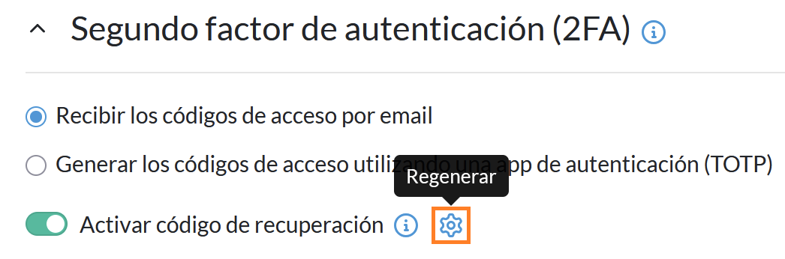

# Activar la autenticación en dos pasos (2FA) con una app de autenticación (TOTP)

Activa la autenticación en dos pasos (2FA) en tu cuenta de GuardedBox usando una app de autenticación compatible con TOTP para mejorar la seguridad de acceso.

## Requisitos

Antes de empezar, asegúrate de tener lo siguiente:

- Una cuenta activa en GuardedBox
- Acceso al correo electrónico asociado a tu cuenta
- Una app de autenticación móvil compatible con TOTP. Por ejemplo:
  - [Microsoft Authenticator](https://support.microsoft.com/en-US/authenticator/download-microsoft-authenticator)
  - [Google Authenticator](https://support.google.com/accounts/answer/1066447?hl=es&co=GENIE.Platform%3DAndroid)
  - [Aegis Authenticator](https://getaegis.app/)

Este procedimiento no modifica tu contraseña ni tus secretos almacenados.

¿Qué es la autenticación en dos pasos (2FA)?

La autenticación en dos pasos (2 Factor Authentication) añade una capa extra de seguridad al iniciar sesión. Al activarla, debes introducir un código de autenticación cada vez que accedas a tu cuenta. El código se envía por correo electrónico o se genera en tu móvil.

Por defecto, GuardedBox usa tu correo electrónico como segundo factor de autenticación.

¿Qué es un código TOTP?

Los códigos TOTP (Time-based One-Time Password) son códigos numéricos temporales que cambian cada pocos segundos y se utilizan como segundo factor de autenticación para aumentar la seguridad.

!!! warning "Advertencia"
    Si pierdes el dispositivo que utilizas para la autenticación en dos pasos, **podrías perder acceso a tu cuenta**. Para evitarlo, [activa el código de recuperación](#codigo-recuperacion) y guárdalo en un lugar seguro.

---

## 1. Localiza la opción de autenticación en dos pasos

1. Accede a tu cuenta de GuardedBox.
2. Selecciona **Mi cuenta** en el panel de navegación.

    

3. Desplázate hasta la sección **Segundo factor de autenticación (2FA)**.

---

## 2. Activa la autenticación en dos pasos con una app {#activar-autenticacion}

1. Selecciona **Generar los códigos de acceso utilizando una app de autenticación (TOTP)**.

    

2. Introduce la contraseña de tu cuenta de GuardedBox en la ventana emergente y selecciona **Continuar**.

    

---

## 3. Confirma la operación con tu app de autenticación

1. Abre tu app de autenticación móvil.
2. Escanea el código QR que aparece en la ventana emergente.
3. Introduce el código generado por tu app de autenticación.
4. Selecciona **Continuar**.

    

!!! warning "Advertencia"
    El código generado por la app solo es válido durante un breve periodo. Después se genera uno nuevo.

Cuando completas la configuración, GuardedBox muestra una ventana de confirmación y envía un correo electrónico para confirmar el cambio.

A partir de este momento:

- Dejas de recibir códigos de acceso por correo electrónico.
- Cada inicio de sesión requiere introducir un código temporal generado en tu app de autenticación.

!!! tip "Consejo"
    Después de activar la autenticación en dos pasos con una app, es recomendable [generar un código de recuperación](#codigo-recuperacion).

## 4. Activa el código de recuperación (opcional) {#codigo-recuperacion}

Un código de recuperación es un código de un solo uso que permite acceder a tu cuenta si no tienes disponible el dispositivo utilizado para la autenticación en dos pasos.

1. Accede a **Mi cuenta** > **Segundo factor de autenticación (2FA)**.
2. Activa la opción **Activar código de recuperación**.

    

3. Introduce la contraseña de tu cuenta de GuardedBox en la ventana emergente.
4. Selecciona **Continuar**.

Cuando completas la configuración, GuardedBox muestra una ventana de confirmación con el código de recuperación y envía un correo electrónico. Copia el código y guárdalo en un lugar seguro pero accesible.

!!! warning "Advertencia"
    - Si pierdes u olvidas el código de recuperación, puedes generar uno nuevo. El código anterior deja de ser válido.
    - Si usas el código de recuperación, se consume y se desactiva. Debes crear uno nuevo para volver a tenerlo disponible.

---

## Problemas frecuentes

!!! danger "No puedo escanear el código QR"
    Si no puedes escanear el código QR con tu app de autenticación:
    
    1. Selecciona **Ingresar clave de configuración** en tu app de autenticación.
    2. Introduce los datos (nombre de cuenta, clave secreta y tipo de clave).
    3. Introduce el código generado por tu app de autenticación en la ventana emergente de GuardedBox.
    4. Selecciona **Continuar**.

!!! danger "Quiero reconfigurar la autenticación en dos pasos con una app de autenticación"
    Para reconfigurar la autenticación en dos pasos:
    
    1. Selecciona el icono de engranaje a la derecha de **Generar los códigos de acceso utilizando una app de autenticación (TOTP)**.

        

    2. Repite el proceso desde el paso 2 de [Activa la autenticación en dos pasos con una app](#activar-autenticacion).

!!! danger "Quiero volver a usar el correo electrónico como segundo factor de autenticación"
    Para volver a usar el correo electrónico:
    
    1. Selecciona **Recibir los códigos de acceso por email**.

        

    2. Introduce la contraseña de tu cuenta de GuardedBox en la ventana emergente.
    3. Selecciona **Continuar**.
    
    Cuando completas la configuración, GuardedBox muestra una ventana de confirmación y envía un correo electrónico para confirmar el cambio.

    A partir de este momento:

    - Dejas de recibir códigos de acceso a través de la app.
    - Cada inicio de sesión requiere introducir un código temporal enviado a tu correo electrónico.

    !!! warning "Advertencia"
        Si dejas de usar la app de autenticación, es recomendable eliminar la clave de GuardedBox almacenada en la aplicación.

!!! danger "No recuerdo o he perdido mi código de recuperación"
    Para regenerar el código de recuperación:
    
    1. Selecciona el icono de engranaje a la derecha de **Activar código de recuperación**.

        

    2. Repite el proceso desde el paso 3 de [4. Activa el código de recuperación (opcional)](#codigo-recuperacion).
