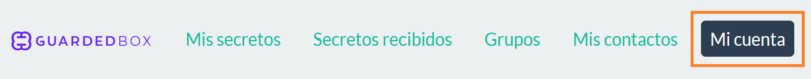
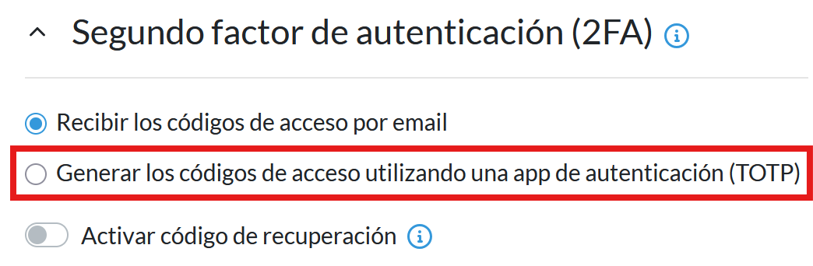
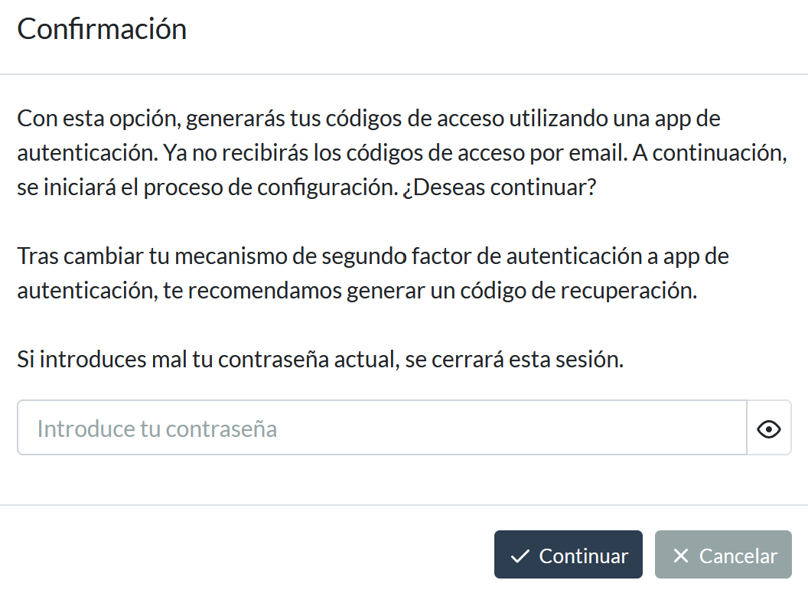
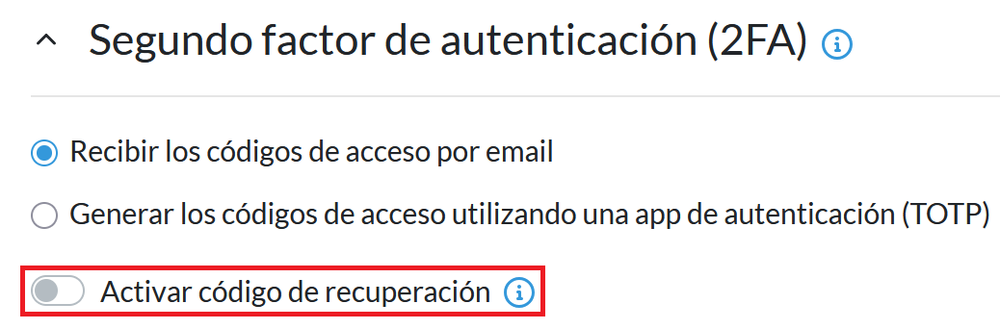
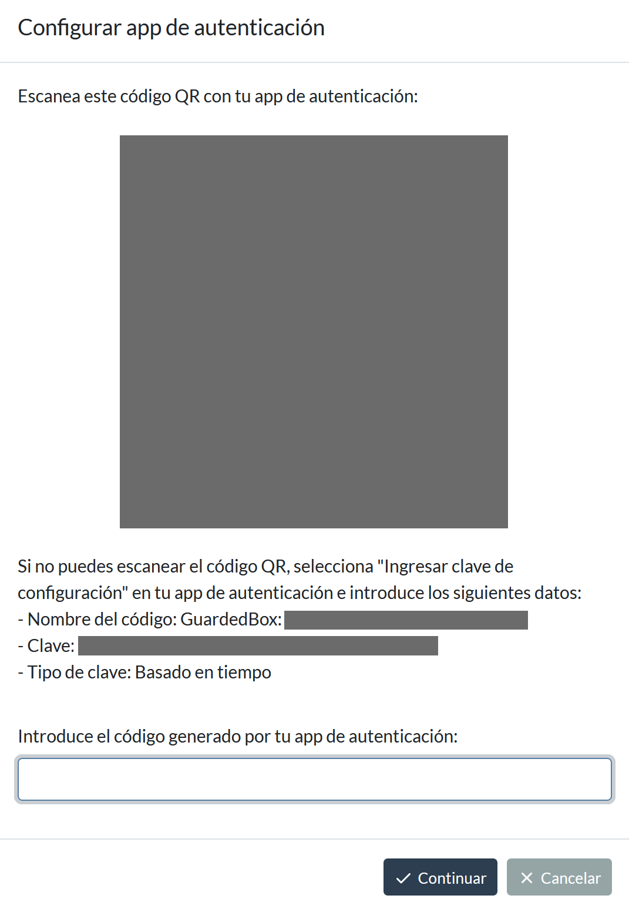
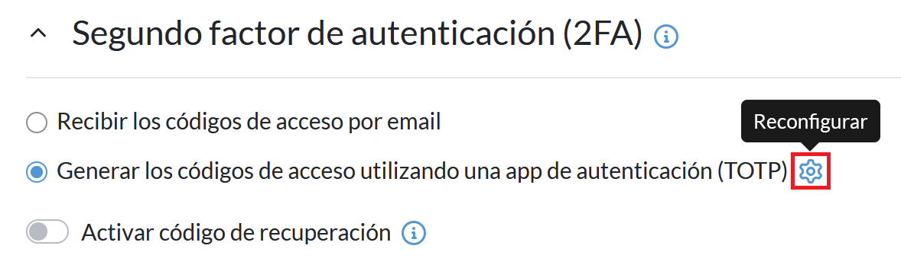
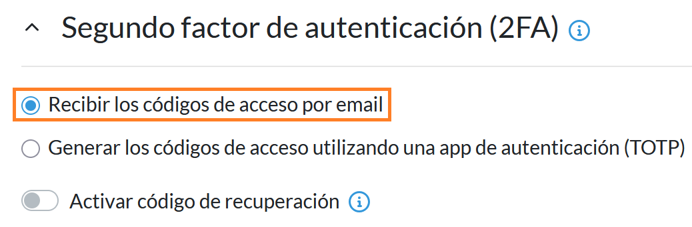

# Cómo activar la autenticación en dos pasos (2FA) con una app de autenticación (TOTP)

## Objetivo

Activar la autenticación en dos pasos (2FA) en tu cuenta de GuardedBox utilizando una aplicación de autenticación compatible con TOTP para mejorar la seguridad de acceso.

Este procedimiento no modifica tu contraseña ni tus secretos almacenados.

## Prerrequisitos

- Una cuenta activa en GuardedBox
- Acceso al correo electrónico asociado a tu cuenta
- Una app de autenticación móvil compatible con TOTP, como **Microsoft Authenticator** o **Google Authenticator**

¿Qué son los TOTP?

Los TOTP, o *Time-based One-time Password*, son códigos numéricos temporales que cambian cada pocos segundos y se utilizan como segundo factor de autenticación para aumentar la seguridad.

!!! warning "Advertencia"
    Si pierdes el dispositivo que utilizas para la verificación en dos pasos, podrías quedarte sin acceso a tu cuenta. Para evitarlo, activa el código de recuperación y guárdalo en un lugar seguro.

---

## 1. Localiza la opción de segundo factor de autenticación

1. Accede a tu cuenta de GuardedBox.
2. Selecciona **Mi cuenta** en el panel de navegación.

3. Desplázate hasta la sección **Segundo factor de autenticación (2FA)**.

---

## 2. Activa la autenticación en dos pasos con una app de autenticación

1. Selecciona **Generar los códigos de acceso utilizando una app de autenticación (TOTP)**.

2. Introduce la contraseña de tu cuenta de GuardedBox en la ventana emergente y selecciona **Continuar**.

!!! tip "Consejo"
    Después de activar la autenticación con app, te recomendamos generar un código de recuperación.

¿Qué es un código de recuperación?

Un código de recuperación es un código de un solo uso que permite acceder a tu cuenta si no tienes disponible el dispositivo utilizado para la autenticación.

---

## 3. Confirma la operación con tu app de autenticación

1. Abre tu app de autenticación móvil. Por ejemplo, **Microsoft Authenticator** o **Google Authenticator**.
2. Escanea el código QR que aparece en la ventana emergente.
3. Introduce el código generado por tu app de autenticación.
4. Selecciona **Continuar**.

!!! warning "Advertencia"
    El código generado por la app solo es válido durante unos segundos. Después se generará uno nuevo.

---

## Resultado esperado

GuardedBox mostrará una ventana de confirmación indicando que la configuración se ha completado correctamente.

A partir de este momento:

- Ya no recibirás códigos de acceso por email.
- Cada inicio de sesión requerirá introducir un código temporal generado en tu app de autenticación.

---

## Resolución de problemas

!!! danger "No puedo escanear el código QR"
    Si no puedes escanear el código QR con tu app de autenticación:

1. Selecciona **Ingresar clave de configuración** en tu app de autenticación.
2. Rellena los datos (nombre de cuenta, clave secreta y tipo de clave).
3. Introduce el código generado por tu app de autenticación.
4. Selecciona **Continuar**.

!!! danger "Quiero reconfigurar la autenticación en dos pasos con una app de autenticación"
    Para reconfigurar el segundo factor:

1. Selecciona el icono de engranaje a la derecha de **Generar los códigos de acceso utilizando una app de autenticación (TOTP)**.

2. Repite el proceso desde el paso **2. Activa la autenticación en dos pasos con una app de autenticación**.

!!! danger "Quiero volver a utilizar el email como segundo factor de autenticación"
    Para volver a utilizar el email:

1. Selecciona **Recibir los códigos de acceso por email**.

2. Introduce la contraseña de tu cuenta de GuardedBox en la ventana emergente.
3. Selecciona **Continuar**.

GuardedBox mostrará una ventana de confirmación indicando que la configuración se ha completado correctamente.

A partir de este momento:

- Ya no recibirás códigos de acceso a través de la app.
- Cada inicio de sesión requerirá introducir un código temporal enviado a tu email.

!!! warning "Advertencia"
    Si dejas de usar la app de autenticación, te recomendamos eliminar la clave de GuardedBox almacenada en la aplicación.
